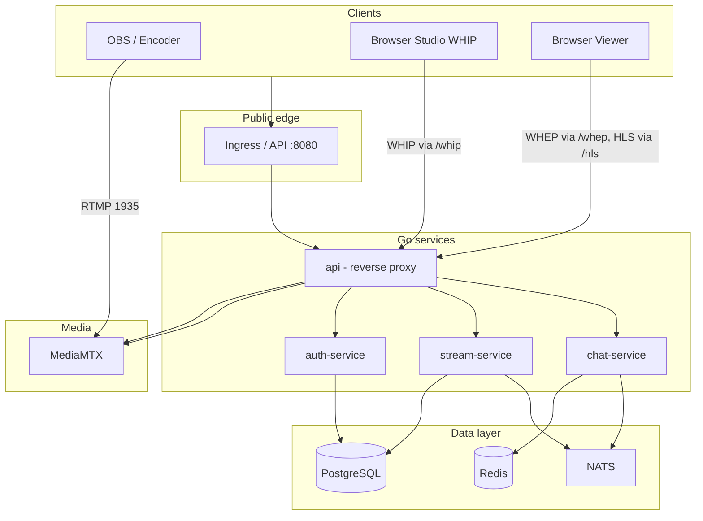

# Live Streaming Platform — Deep Dive Guide

This document explains **what** the platform is, **how** the pieces fit together, and **why** common design choices were made. It is written for someone who did not build the system but wants to understand it well enough to operate it, extend it, or design something similar later.

---

## Table of contents

1. [What problem does this solve?](#1-what-problem-does-this-solve)
2. [Glossary](#2-glossary)
3. [Big-picture architecture](#3-big-picture-architecture)
4. [Technology stack](#4-technology-stack)
5. [The media path (RTMP, HLS, WebRTC)](#5-the-media-path-rtmp-hls-webrtc)
6. [The control plane (Go microservices)](#6-the-control-plane-go-microservices)
7. [Data, messaging, and state](#7-data-messaging-and-state)
8. [Security model](#8-security-model)
9. [Frontend (Next.js)](#9-frontend-nextjs)
10. [Configuration and environment variables](#10-configuration-and-environment-variables)
11. [Running locally (Docker Compose)](#11-running-locally-docker-compose)
12. [Running on Kubernetes](#12-running-on-kubernetes)
13. [AWS infrastructure (Terraform)](#13-aws-infrastructure-terraform)
14. [Observability](#14-observability)
15. [Important behaviors and edge cases](#15-important-behaviors-and-edge-cases)
16. [How you could build something similar](#16-how-you-could-build-something-similar)
17. [File and module reference](#17-file-and-module-reference)

---

## 1. What problem does this solve?

The platform lets **broadcasters** create **live streams**, publish video using **OBS** (RTMP) or the **browser** (WHIP/WebRTC), and lets **viewers** watch with **low-latency WebRTC (WHEP)** when possible, with **HLS** as a fallback. It also provides **live chat** per stream and basic **user accounts** (register, login, roles).

Conceptually it is **broadcast-first**: one (or few) publishers, many viewers — closer to Twitch/YouTube Live than to Google Meet (many equal participants).

---

## 2. Glossary

| Term | Meaning |
|------|---------|
| **Ingest** | Getting encoded video *into* your system (RTMP or WHIP). |
| **Playback** | Getting video *out* to viewers (HLS segments, or WHEP/WebRTC). |
| **Media server** | Software that accepts ingest and serves playback; here **MediaMTX**. |
| **RTMP** | Classic protocol used by OBS to push streams to a server (`rtmp://host/app/streamKey`). |
| **HLS** | HTTP Live Streaming: video split into small files (`.ts`) and a playlist (`.m3u8`). Higher latency than WebRTC but very compatible. |
| **WHIP** | WebRTC-HTTP Ingest Protocol: browser (or tool) publishes WebRTC to the server over HTTP. |
| **WHEP** | WebRTC-HTTP Egress Protocol: browser subscribes to a WebRTC stream over HTTP. |
| **Stream key** | Secret string in the RTMP URL path; identifies which logical stream is publishing. |
| **Control plane** | Services that manage users, stream metadata, signing URLs, chat — not the raw video bytes. |
| **Edge / API gateway** | Single public HTTP entry (`api` service) that reverse-proxies to other services and MediaMTX paths. |
| **EKS** | Amazon Elastic Kubernetes Service — managed Kubernetes on AWS. |

---

## 3. Big-picture architecture

### 3.1 Logical view



### 3.2 Request routing idea

- **Browsers** talk only to **one origin** (e.g. `https://your-domain`). That traffic hits **Ingress → `api` →** either an internal Go service, the **Next.js frontend**, or a **reverse proxy** to MediaMTX (HLS, WHIP, WHEP).
- **OBS** typically talks **directly** to the **RTMP endpoint** (in AWS, often a **Network Load Balancer** in front of MediaMTX port 1935), because browsers cannot speak RTMP.

### 3.3 Separation of concerns

| Layer | Responsibility |
|-------|----------------|
| **Frontend** | UI, WebRTC in the browser, calling JSON APIs. |
| **api** | TLS termination path (via ingress), CORS for WHIP/WHEP, path-based routing, **signed HLS gate** for `.m3u8`. |
| **stream-service** | Stream CRUD, URLs, status (`created` → `live` → `ended`), playback validation, optional **MediaMTX API polling** to detect ingest. |
| **auth-service** | Users, passwords, JWT issuance. |
| **chat-service** | Messages in Redis, SSE for live updates, reacts to stream lifecycle over NATS. |
| **MediaMTX** | RTMP/HLS/WebRTC protocols; paths like `live/<streamKey>`. |

---

## 4. Technology stack

### 4.1 Languages and frameworks

| Area | Choice | Role |
|------|--------|------|
| Backend | **Go 1.25** | HTTP services, small binaries, good concurrency. |
| Frontend | **Next.js 16** + **React 19** | App UI, Server Components / Server Actions where used. |
| Styling | **Tailwind CSS 4** | Utility-first CSS. |
| Media | **MediaMTX** (`bluenviron/mediamtx`) | RTMP, HLS, WHIP/WHEP in one process. |

### 4.2 Data and infrastructure libraries (Go)

- **PostgreSQL** via `jackc/pgx/v5` — durable users and streams.
- **Redis** via `redis/go-redis/v9` — chat message storage (fast, ephemeral-friendly).
- **NATS** via `nats-io/nats.go` — pub/sub for stream lifecycle events (chat bot messages, decoupling).
- **AWS SDK v2** — S3 presigned uploads for stream **assets** (when enabled).
- **OpenTelemetry** — traces/metrics hooks through a shared `runtime` package.
- **Prometheus** client — scrape endpoints on services.

### 4.3 Frontend media

- **hls.js** — play HLS in browsers that do not natively support it well enough.
- **Browser WebRTC APIs** — `RTCPeerConnection` for WHIP (publish) and WHEP (play).

---

## 5. The media path (RTMP, HLS, WebRTC)

### 5.1 MediaMTX path naming

Configuration uses a **regex path** so any stream key under the `live` application is accepted:

```yaml
paths:
  "~^live/.+$":
    source: publisher
```

So a publisher uses path **`live/<streamKey>`** (RTMP URL often looks like `rtmp://host/live/<streamKey>`).

### 5.2 RTMP (OBS)

1. User creates a stream in the app; `stream-service` stores a random **stream key** and returns an **RTMP URL** built from `RTMP_BASE_URL` + `STREAM_APP_NAME` + key.
2. OBS connects to MediaMTX and starts publishing.
3. The **platform** must transition the stream status from `created` to `live`:
   - **Option A:** MediaMTX runs a hook that HTTP POSTs to a signed callback (when hooks are wired).
   - **Option B (implemented):** `stream-service` periodically calls MediaMTX **Control API** (`GET /v3/paths/list`) and, for each stream still in `created`, checks if path `live/<streamKey>` has a publisher; if yes, it calls `MarkLiveByKey`.

### 5.3 HLS playback

1. MediaMTX serves HLS (e.g. under `/live/<streamKey>/` depending on `HLS_BASE_URL` wiring).
2. `stream-service` builds a **playback URL** pointing at the **public** site:  
   `/hls/<streamKey>/index.m3u8?expires=...&signature=...`
3. The **`api`** service intercepts `.m3u8` requests, calls **`stream-service` `/playback/validate`**, and only proxies to MediaMTX if the HMAC signature and expiry are valid. This avoids exposing unsigned HLS to the world.

### 5.4 WHIP (browser publish) and WHEP (browser play)

- WHIP and WHEP are HTTP signaling layered on WebRTC. MediaMTX exposes them on its WebRTC HTTP port (e.g. **8889**).
- The **`api`** service exposes **`/whip/`** and **`/whep/`** with CORS headers and reverse-proxies to `WHIPBaseURL` (same upstream as WHIP; WHEP shares that WebRTC server).
- **UDP** (e.g. **8189**) is required for WebRTC media. In Kubernetes this means the MediaMTX **Service** must expose UDP and, on cloud load balancers, you often need **NLB** or similar — TCP-only ingress controllers are not enough for WebRTC.

### 5.5 `webrtcAdditionalHosts`

For WHEP/WHIP behind a load balancer, ICE candidates must include the **public hostname** clients use. MediaMTX config includes **`webrtcAdditionalHosts`** listing that hostname (e.g. NLB DNS name). After recreating infrastructure, this value must match the new load balancer DNS name.

### 5.6 MediaMTX Control API and `authInternalUsers`

The Control API (default port **9997**) is used by `stream-service` to list paths. MediaMTX restricts API access by default; the deployment adds **`authInternalUsers`** so in-cluster callers can use the API without shelling into the container (the MediaMTX image has no shell for `curl` hooks).

### 5.7 H.264, B-frames, and HLS fallback

Some OBS H.264 settings produce **B-frames**. Many browser **WebRTC** decoders reject that for playback, while **HLS** remuxing may still work. The viewer UI can try **WHEP first** and **fall back to HLS** (via hls.js) when WebRTC fails or times out. For best WebRTC compatibility, OBS users are often steered toward **baseline profile** / **no B-frames** (`bf=0` in x264).

---

## 6. The control plane (Go microservices)

All Go services share the same **bootstrap pattern** (`internal/platform/runtime`): load config, structured logging, OpenTelemetry setup, standard **health/metrics** routes, graceful shutdown.

### 6.1 `cmd/api` — API gateway

**Role:** Single HTTP façade.

- **`/auth/*`** → `auth-service`
- **`/streams/*`** → `stream-service` or **`chat-service`** when path contains `/messages` or `/events`
- **`/public/streams*`** → `stream-service` (public catalog)
- **`/whip/*`, `/whep/*`** → MediaMTX (with CORS)
- **`/hls/*`** → validate signature on **playlist** requests, then proxy to MediaMTX HLS
- **`/`** → Next.js **frontend**

Implementation uses `httputil.ReverseProxy` and sets `Host` header to the upstream so virtual-host style routing works.

### 6.2 `cmd/auth-service`

**Role:** Identity.

- `POST /register` — creates user; optional **bootstrap admin** if email is in `BOOTSTRAP_ADMIN_EMAILS`.
- `POST /login` — verifies password, returns **JWT**.
- `GET /me` (and related) — JWT-protected profile/role updates.

**Storage:** PostgreSQL (`users`, password hashes; migrations add **roles**).

### 6.3 `cmd/stream-service`

**Role:** Stream lifecycle and media URL construction.

- Authenticated: list/create streams, get stream details, **go-live** (manual), **end**, **delete**, **assets** (S3 presign).
- `POST /streams/live` — **ingest webhook**: internal header token + HMAC query params; marks stream live by key (intended for MediaMTX or edge hooks).
- `GET /playback/validate` — used by `api` to gate HLS.
- **Background goroutine:** if `MEDIAMTX_API_URL` is set, every ~3s poll MediaMTX for active publishers and promote matching streams from `created` to `live`, publishing NATS lifecycle events.

### 6.4 `cmd/chat-service`

**Role:** Per-stream chat.

- `GET /streams/{id}/messages` — history from Redis.
- `POST /streams/{id}/messages` — JWT required; append message.
- `GET /streams/{id}/events` — **Server-Sent Events (SSE)** for real-time delivery (simplified fan-out).

**NATS subscription:** On `stream.lifecycle`, inserts a **system** message when status changes (e.g. stream went live).

---

## 7. Data, messaging, and state

### 7.1 PostgreSQL schema (conceptual)

- **`users`** — id, email, display name, password hash, timestamps; later **role** (admin/moderator/broadcaster).
- **`streams`** — id, title, description, **stream_key**, **owner_id**, **status**, playback/rtmp URLs (URLs are also **recomputed** on read in the service layer), timestamps.
- **Assets** (migration 002) — optional files linked to streams (S3 keys, metadata).

Migrations live in `internal/platform/postgres/migrations/` and run automatically on service startup (`postgres.RunMigrations`).

### 7.2 Redis

Chat messages keyed by stream id (see `internal/chat`). Fast reads for recent history; not the source of truth for financial data — tuned for **live** chat.

### 7.3 NATS

- Subject: **`stream.lifecycle`** (`internal/stream/events.go`).
- **Publishers:** `stream-service` when streams are created, marked live, ended, etc.
- **Consumers:** `chat-service` adds system messages.

This pattern **decouples** stream state changes from chat without chat needing to poll PostgreSQL.

---

## 8. Security model

### 8.1 User authentication — JWT

- After login, the browser stores a JWT (implementation detail in frontend) and sends `Authorization: Bearer ...` on protected API calls.
- Go middleware (`internal/auth`) parses JWT, checks signature with `JWT_SECRET`, puts **user id, role** in `context`.

### 8.2 HLS playback — signed URLs

- Playback URL includes `expires` (unix seconds) and `signature` = HMAC-SHA256 over `streamKey:expires` with `PLAYBACK_SIGNING_KEY`.
- Only the **m3u8** request is validated at the edge (`api`); segment requests may follow the same path prefix — design assumes protecting the manifest and relying on short TTL / obscurity for segments (tightening this further is a possible hardening step).

### 8.3 Ingest webhook — signed + internal token

- `IngestCallbackURL` includes `timestamp` and HMAC over `streamKey:timestamp` with `INGEST_SIGNING_KEY`, valid within `MEDIA_WEBHOOK_CLOCK_SKEW`.
- Header `X-Internal-Service-Token` (configurable name) must match `INTERNAL_SERVICE_TOKEN` so random internet clients cannot mark streams live.

### 8.4 Internal service trust

Services trust each other when placed behind network policies; the **api** trusts **stream-service** for `/playback/validate`. For production, **mTLS** or mesh identity is a common upgrade.

---

## 9. Frontend (Next.js)

### 9.1 Layout

- **`frontend/app`** — routes (dashboard, watch pages, etc.).
- **`frontend/components/streams`** — stream cards, **studio** (OBS + browser encoder), **stream player** (WHEP + HLS).
- **`frontend/lib/api.ts`** — fetch helpers against the API.
- **`frontend/lib/whip.ts`** / **`whep.ts`** — WebRTC + HTTP signaling to **`/whip/...`** and **`/whep/...`**.

### 9.2 Studio behavior

- Shows **RTMP server URL** and **stream key** separately (so OBS does not double-append the key in the path).
- **Browser studio** uses WHIP to publish the webcam.
- **sessionStorage** may track an “active” stream so refresh does not lose context; user can **end** or **delete** streams from the UI.

### 9.3 Viewer

- Tries **WHEP** for low latency; on failure or timeout, uses **hls.js** with the signed **playback URL**.
- Chat uses polling or SSE depending on component wiring.

### 9.4 Server Actions and replicas

Next.js **Server Actions** embed server-side IDs in the client bundle. If **multiple frontend pods** run different builds or versions, action mismatches can cause intermittent errors. The Kubernetes deployment may pin **frontend replicas to 1** (and HPA min/max 1) to avoid that class of bug until a unified build/version strategy is in place.

---

## 10. Configuration and environment variables

Central definition: `internal/platform/config/config.go`.

Important groups:

| Group | Examples | Purpose |
|-------|----------|---------|
| Inter-service URLs | `AUTH_SERVICE_URL`, `STREAM_SERVICE_URL`, `CHAT_SERVICE_URL`, `FRONTEND_URL` | Used by `api` reverse proxy. |
| Media | `PUBLIC_BASE_URL`, `RTMP_BASE_URL`, `HLS_BASE_URL`, `WHIP_BASE_URL`, `STREAM_APP_NAME`, `MEDIAMTX_API_URL` | URL generation + polling. |
| Signing | `PLAYBACK_SIGNING_KEY`, `INGEST_SIGNING_KEY` | HMAC secrets — must be strong in production. |
| Security | `JWT_SECRET`, `INTERNAL_SERVICE_TOKEN`, `BOOTSTRAP_ADMIN_EMAILS` | Auth + webhooks. |
| Storage | `MEDIA_BUCKET_NAME`, `AWS_REGION`, `S3_ENDPOINT`, `S3_USE_PATH_STYLE` | S3-compatible presign for assets. |
| Observability | `OTEL_EXPORTER_OTLP_ENDPOINT` | Traces to collector. |

Kubernetes **`deploy/k8s/base/config.yaml`** holds non-secret defaults; secrets in **`platform-secrets`**. Overlays (e.g. `deploy/k8s/overlays/dev`) patch URLs for real domains and RDS/Redis.

---

## 11. Running locally (Docker Compose)

File: `deploy/docker/docker-compose.yml`.

- Builds **frontend** and **api** + three Go services from `deploy/docker/Dockerfile.*`.
- Runs **Postgres**, **Redis**, **NATS**, **MinIO** (S3-compatible), **MediaMTX**, **Prometheus**, **Loki**, **Tempo**, **Grafana**, **OTel collector**.

Typical ports:

| Port | Service |
|------|---------|
| 3001 | Next.js (mapped from container 3000) |
| 8080 | API edge |
| 1935 | RTMP |
| 8888 | HLS |
| 8889 | WHIP/WHEP HTTP |
| 8189/udp | WebRTC UDP (local) |

Env: copy **`.env.example`** to **`.env`** and adjust.

---

## 12. Running on Kubernetes

- **Kustomize** base: `deploy/k8s/base/kustomization.yaml` wires deployments, config, ingress, **HorizontalPodAutoscaler** (`operations.yaml`), etc.
- **Ingress**: `deploy/k8s/base/ingress.yaml` — **nginx** ingress class; long timeouts for streaming; routes listed earlier.
- **MediaMTX**: `deploy/k8s/base/mediamtx/` — Deployment + ClusterIP Service + **separate NLB-type services** for RTMP and WebRTC in production overlays (TCP + UDP).
- **Config**: merge **overlay** patches instead of re-applying only base `config.yaml`, which can overwrite environment-specific DSNs and URLs.

---

## 13. AWS infrastructure (Terraform)

Root example: `deploy/terraform/aws/environments/dev/main.tf`.

Modules (conceptual):

| Module | Purpose |
|--------|---------|
| **network** | VPC, public/private subnets, NAT, IGW. |
| **eks** | Kubernetes cluster + managed node groups. |
| **rds** | PostgreSQL in private subnets. |
| **elasticache** | Redis. |
| **storage** | S3 bucket, CloudFront + OAI/OAC patterns, media artifacts. |
| **ecr** | Container registries per service image. |
| **iam** | IRSA / OIDC-linked roles for pods accessing S3/secrets. |
| **edge** | WAF Web ACL for CloudFront or ALB. |
| **secrets** | Secrets Manager entries (e.g. JWT, signing keys). |
| **observability** | Log groups, etc. |

**State:** S3 backend + DynamoDB locking (see `terraform` block in `main.tf`).

**DNS:** Often **outside** this repo (e.g. registrar CNAME to NLB). **ACM** certificates may be created in the AWS console and attached to load balancers — not always represented in Terraform.

**Teardown note:** After `terraform destroy`, **Kubernetes-created NLBs** can remain and block subnet deletion; delete orphan **ELBv2** load balancers if subnets fail to destroy.

---

## 14. Observability

- **OpenTelemetry** exporter from Go services → **OTel Collector** → **Tempo** (traces).
- **Prometheus** scrapes metrics; **Grafana** dashboards under `observability/grafana/`.
- **Loki** for log aggregation (config under `observability/loki/`).

See also `docs/architecture/slo.md` and `docs/runbooks/` for operational angles.

---

## 15. Important behaviors and edge cases

1. **Stream goes `live`:** Either webhook to `/streams/live`, manual **go-live** API, or **MediaMTX API polling** when `MEDIAMTX_API_URL` is set.
2. **OBS URL:** Server URL must not include the stream key; key goes in OBS’s separate “Stream Key” field.
3. **WebRTC vs HLS:** WHEP may fail for certain H.264 configurations; HLS is the compatibility layer.
4. **Frontend scaling:** Multiple replicas need consistent Server Action deployment strategy.
5. **ConfigMap apply:** Blind `kubectl apply` of base config can reset production DSNs — use kustomize or patches.
6. **Destroy order:** NLBs from `LoadBalancer` Services may outlive the cluster briefly — clean up in EC2/ELB if Terraform hangs on subnets.

---

## 16. How you could build something similar

A possible learning and implementation order:

1. **Single binary** that serves HLS from a folder — understand **m3u8** and segments.
2. Add **RTMP ingest** (MediaMTX or nginx-rtmp) — one publisher, one path.
3. Add **PostgreSQL** + minimal **REST** — “create stream” returns a **stream key**.
4. Put **nginx** or Go **reverse proxy** in front; terminate TLS.
5. Add **signed URLs** for playback (HMAC).
6. Add **JWT auth** and user ownership of streams.
7. Add **chat** with Redis + **SSE**.
8. Introduce **NATS** (or Redis pub/sub) for lifecycle events.
9. Add **WHIP/WHEP** for browser ingest/playback; learn **ICE**, **STUN/TURN**, and **UDP** on your cloud.
10. Containerize → **Kubernetes** → **Terraform** for VPC + EKS + RDS.
11. Add **CDN** (CloudFront) in front of HLS for scale.
12. Harden: rate limits, WAF, secret rotation, backup/restore runbooks.

---

## 17. File and module reference

| Path | What to look for |
|------|-------------------|
| `cmd/api/main.go` | Routing, HLS signature gate, proxies. |
| `cmd/stream-service/main.go` | REST handlers, webhook, MediaMTX poll loop. |
| `cmd/auth-service/main.go` | Register/login/JWT. |
| `cmd/chat-service/main.go` | Messages, SSE, NATS subscriber. |
| `internal/stream/service.go` | Stream model, URL building, HMAC helpers. |
| `internal/stream/repository.go` | SQL access. |
| `internal/mediamtx/client.go` | MediaMTX Control API client. |
| `internal/auth/` | JWT middleware, user service. |
| `internal/chat/` | Redis-backed chat. |
| `internal/platform/config/config.go` | All env configuration. |
| `internal/platform/runtime/runtime.go` | Shared server bootstrap. |
| `frontend/lib/whip.ts`, `whep.ts` | Browser WebRTC signaling. |
| `frontend/components/streams/stream-player.tsx` | WHEP + HLS fallback. |
| `deploy/docker/docker-compose.yml` | Local stack. |
| `deploy/k8s/base/` | Kubernetes manifests. |
| `deploy/terraform/aws/` | AWS modules and environments. |
| `docs/architecture/overview.md` | Short ADR-style summary. |

---

*This guide reflects the repository as a teaching-oriented map. When you change behavior in code, update the relevant section here so the next reader (including future you) stays aligned with reality.*
